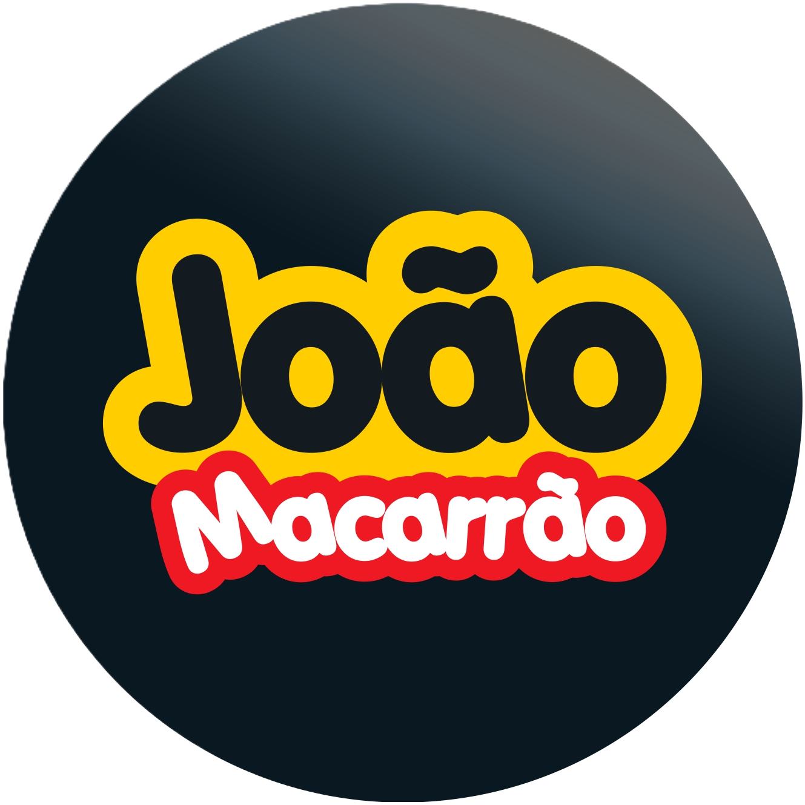

# 🍝 João Macarrão - "Tecnologia a serviço do sabor e da inclusão."

**Projeto Integrador - UNIVESP**  
Eixo: Tecnologia da Informação e Computação



---

## 📖 Visão Geral 

O **João Macarrão** é um restaurante de massas artesanais localizado em Bertioga-SP que busca unir sabor, tecnologia e inclusão. Este projeto consiste em um **cardápio digital interativo e acessível**, que permite ao cliente visualizar os pratos, ouvir suas descrições, assistir a vídeos curtos e realizar pedidos e pagamentos diretamente pelo aplicativo.

O sistema é projetado com **inclusão audiovisual**, sendo acessível para pessoas com deficiência visual ou auditiva, e utiliza uma arquitetura web moderna e responsiva.

> **"Com o sabor autêntico do litoral"**

---

## 📍 Informações do Restaurante

**📌 Endereço:**  
Av. Anchieta, 2969 - Maitinga  
Bertioga - SP, CEP: 11251-175  
Centro Comercial Maitinga  
📍 [Ver no Google Maps](https://www.google.com/maps/place/5V8G%2BQ4+Maitinga,+Bertioga+-+SP)

**⏰ Horário de Funcionamento:**
- **Terça a Sábado:** 18:00 - 23:00
- **Domingo e Segunda:** Fechado

**📱 Contatos:**
- **WhatsApp:** [(13) 98166-9000](https://wa.me/5513981669000)
- **Instagram:** [@joaomacarrao013](https://www.instagram.com/joaomacarrao013?igsh=MTh3MnBoeWdhMmZtMg==)
- **iFood:** [Fazer Pedido](https://www.ifood.com.br/delivery/bertioga-sp/joao-macarrao-maitinga/5fd00482-a61c-48d6-a25a-a2edae29d59f?UTM_Medium=share)

---

## 🍽️ Funcionalidades Principais

### 👥 Usuários e Administração
- ✅ Cadastro e autenticação de usuários (clientes, atendentes, admin)
- ✅ Painel administrativo com gerenciamento de pratos, categorias e mídias
- ✅ Controle de disponibilidade e estoque
- ✅ Dashboard com estatísticas e relatórios

### 📋 Cardápio Digital Interativo
- ✅ Exibição por categorias: Massas, Molhos, Acompanhamentos, Bebidas e Sobremesas
- ✅ Descrições narradas por áudio e vídeos demonstrativos
- ✅ Filtros e busca por nome ou tipo de prato
- ✅ Sistema de avaliações e reviews
- ✅ Carrinho de compras integrado

### ♿ Inclusão Audiovisual (WCAG 2.1 AA)
- 🔊 Áudio narrado das descrições via Text-to-Speech
- 🎥 Vídeos curtos integrados (pré-preparo e apresentação do prato)
- 🦾 Tradução para Libras
- 👁️ Alto contraste e ajuste de fonte
- ⌨️ Navegação por teclado
- 📖 Modo de leitura simplificada

### 💳 Pagamento In-App
- 💰 Integração com APIs de pagamento seguras
- **Métodos suportados:**
  - PIX (QR Code automático)
  - Cartão de crédito/débito (via Stripe)
  - Dinheiro (pagamento no local)
- 📧 Histórico de pedidos e comprovantes

### 💬 Contato e Feedback
- 📝 Formulário de contato direto com o restaurante
- ⭐ Sistema de avaliações e reviews de pratos
- 📊 Feedback de experiência do usuário

---

## 🧱 Arquitetura do Sistema

### 🖥️ Backend
- **Linguagem:** Python 3.13+
- **Framework:** Django 4.2
- **API REST:** Django REST Framework
- **Banco de Dados:** SQLite (dev) / PostgreSQL (prod)
- **Autenticação:** JWT (SimpleJWT)
- **Integrações:**
  - Text-to-Speech (áudio narrado)
  - Stripe (pagamentos com cartão)
  - PIX API (pagamentos PIX)

### 💻 Frontend
- **Framework:** React 18 + TypeScript
- **Build Tool:** Vite
- **Gerenciamento de Estado:** Zustand
- **Roteamento:** React Router v6
- **Comunicação com API:** Axios
- **UI Components:** Lucide React (ícones)
- **Notificações:** React Toastify
- **Acessibilidade:** Custom hooks + ARIA
- **Pagamentos:** Stripe.js SDK

---

## 🗂️ Estrutura do Projeto

```
JoaoMacarrao/
│
├── backend/                    # Django API
│   ├── apps/
│   │   ├── api/               # Endpoints principais
│   │   ├── core/              # Models (User, Dish, Order)
│   │   ├── payments/          # Sistema de pagamentos
│   │   ├── reviews/           # Avaliações
│   │   ├── contact/           # Formulário de contato
│   │   └── accessibility/     # Recursos de acessibilidade
│   ├── backend/               # Configurações Django
│   ├── requirements.txt
│   └── manage.py
│
├── frontend/                   # React App
│   ├── src/
│   │   ├── components/        # Componentes reutilizáveis
│   │   ├── pages/             # Páginas (Home, About, Cart, etc)
│   │   ├── hooks/             # Custom hooks
│   │   ├── services/          # Serviços/API
│   │   ├── stores/            # Zustand stores
│   │   ├── styles/            # CSS
│   │   └── types/             # TypeScript types
│   ├── public/
│   │   └── assets/            # Logo e imagens
│   ├── package.json
│   └── vite.config.ts
│
└── README.md
```

---

## ⚙️ Requisitos de Sistema

- **Python:** 3.13+
- **Node.js:** 18+
- **PostgreSQL:** 14+ (produção)
- **Conta de Desenvolvedor:** Stripe (opcional para pagamentos)

---

## 🧩 Configuração do Ambiente

### Backend

```bash
cd backend
python -m venv venv
venv\Scripts\activate      # Windows
source venv/bin/activate   # Linux/Mac
pip install -r requirements.txt
python manage.py migrate
python manage.py runserver
```

### Frontend

```bash
cd frontend
npm install
npm run dev
```

---

## 🌐 Acessos Locais

- **Backend API:** http://localhost:8000
- **Admin Django:** http://localhost:8000/admin
- **API REST:** http://localhost:8000/api
- **Frontend:** http://localhost:3000

---

## 🎨 Identidade Visual

**Paleta de Cores:**
- 🟡 Amarelo Massa: `#FFC300`
- 🔴 Vermelho Molho: `#E63946`
- 🔵 Azul Oceano: `#004E7C` → `#39CCCC`
- ⚫ Antracite: `#1A1A1D`
- 🤍 Creme: `#FFF5E4`

**Tema:** Oceânico com ondas animadas e gradientes do mar

---

## 🧠 Boas Práticas e Padrões

O projeto segue princípios de:
- ✅ Arquitetura RESTful
- ✅ Componentização e reutilização de código (React + DRY)
- ✅ Acessibilidade Web (WCAG 2.1 AA)
- ✅ Segurança em transações (HTTPS, JWT, CSRF)
- ✅ Versionamento com Git e GitHub
- ✅ Deploy em nuvem (Render, Vercel ou Netlify)
- ✅ Código limpo e documentado
- ✅ Responsive Design (Mobile First)

---

## 📱 Features Implementadas

### Para Clientes
- ✅ Visualizar cardápio completo
- ✅ Adicionar pratos ao carrinho
- ✅ Fazer pedidos online
- ✅ Múltiplas formas de pagamento
- ✅ Acompanhar status do pedido
- ✅ Avaliar pratos
- ✅ Contato direto via formulário
- ✅ Recursos de acessibilidade

### Para Administradores
- ✅ Dashboard com estatísticas
- ✅ Gerenciar cardápio (CRUD)
- ✅ Visualizar e gerenciar pedidos
- ✅ Acompanhar vendas e relatórios
- ✅ Ver avaliações dos clientes
- ✅ Gerenciar mensagens de contato

---

## 👩‍💻 Equipe de Desenvolvimento

**Projeto Integrador - UNIVESP**

### Coordenação
- **Daii Burgo** - Líder do Projeto

### Membros do Grupo
- Daiana S. Lespier
- Filipe S. Gomes
- Helder L. P. Costa
- João Vitor V. de Oliveira
- Regina Mancini
- Welinton Arantes
- Yolanda Maria Fanucchi

---

## 📄 Licença

Este projeto está licenciado sob a **MIT License**.

© 2025 João Macarrão. Todos os direitos reservados.

---

**Desenvolvido com ❤️ e 🍝 em Bertioga-SP**

*"Tecnologia a serviço do sabor e da inclusão."*
