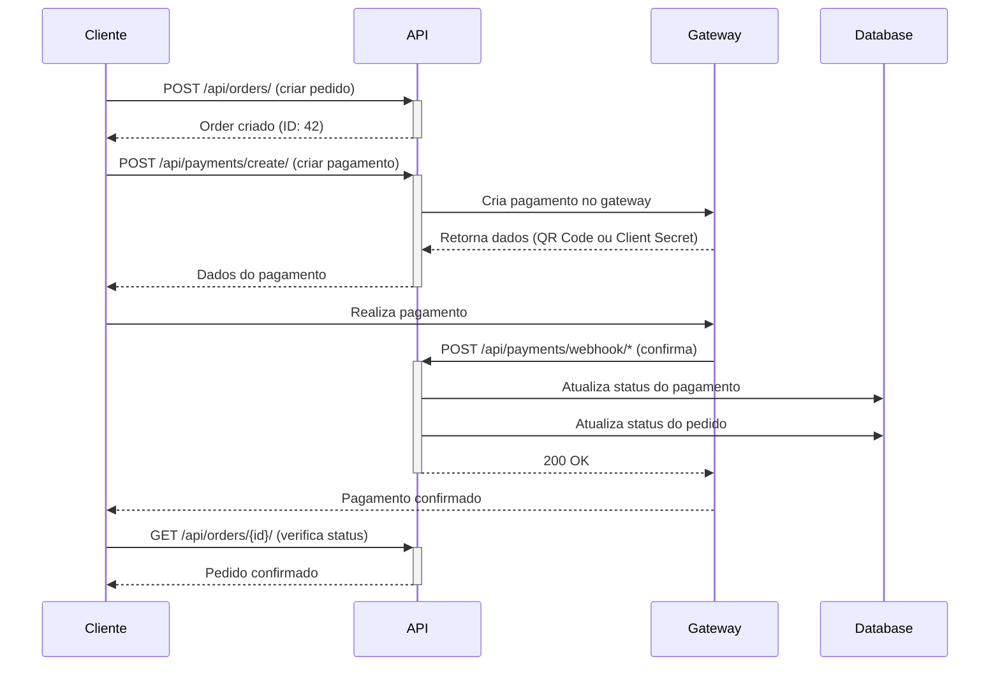

# 💳 API de Pedidos e Pagamentos - João Macarrão

Documentação completa dos endpoints de pedidos e pagamentos.

---

## 🔐 Autenticação

Todos os endpoints requerem autenticação via JWT Bearer Token.

```http
Authorization: Bearer {access_token}
```

---

## 📦 Endpoints de Pedidos

### 1. Criar Pedido

```http
POST /api/orders/
Content-Type: application/json
Authorization: Bearer {token}

{
  "payment_method": "pix",
  "delivery_address": "Rua Exemplo, 123, Apto 45",
  "delivery_city": "São Paulo",
  "delivery_zip_code": "01234-567",
  "delivery_fee": 5.00,
  "notes": "Sem cebola, por favor",
  "items": [
    {
      "dish_id": 1,
      "quantity": 2,
      "notes": "Bem passado"
    },
    {
      "dish_id": 3,
      "quantity": 1,
      "notes": ""
    }
  ]
}
```

**Resposta (201 Created):**
```json
{
  "id": 42,
  "user": 1,
  "user_name": "João Silva",
  "user_email": "joao@example.com",
  "status": "pending",
  "status_display": "Pendente",
  "payment_method": "pix",
  "payment_method_display": "PIX",
  "payment_status": "pending",
  "delivery_address": "Rua Exemplo, 123, Apto 45",
  "delivery_city": "São Paulo",
  "delivery_zip_code": "01234-567",
  "subtotal": "45.00",
  "delivery_fee": "5.00",
  "total": "50.00",
  "notes": "Sem cebola, por favor",
  "items": [
    {
      "id": 1,
      "dish_id": 1,
      "dish_name": "Macarrão à Bolonhesa",
      "quantity": 2,
      "unit_price": "20.00",
      "subtotal": "40.00",
      "notes": "Bem passado"
    },
    {
      "id": 2,
      "dish_id": 3,
      "dish_name": "Pizza Margherita",
      "quantity": 1,
      "unit_price": "5.00",
      "subtotal": "5.00",
      "notes": ""
    }
  ],
  "items_count": 3,
  "created_at": "2025-10-22T14:30:00Z",
  "updated_at": "2025-10-22T14:30:00Z",
  "confirmed_at": null,
  "delivered_at": null
}
```

---

### 2. Listar Meus Pedidos

```http
GET /api/orders/my_orders/
Authorization: Bearer {token}
```

**Parâmetros de Query:**
- `status` - Filtrar por status (pending, confirmed, preparing, ready, delivering, delivered, cancelled)
- `ordering` - Ordenação (-created_at, total, status)
- `page` - Número da página

**Resposta (200 OK):**
```json
{
  "count": 10,
  "next": "http://localhost:8000/api/orders/my_orders/?page=2",
  "previous": null,
  "results": [
    {
      "id": 42,
      "user_name": "João Silva",
      "status": "pending",
      "status_display": "Pendente",
      "total": "50.00",
      "items_count": 3,
      "created_at": "2025-10-22T14:30:00Z"
    }
  ]
}
```

---

### 3. Detalhar Pedido

```http
GET /api/orders/{id}/
Authorization: Bearer {token}
```

**Resposta (200 OK):** (mesmo formato do criar pedido)

---

### 4. Cancelar Pedido

```http
POST /api/orders/{id}/cancel/
Authorization: Bearer {token}
```

**Resposta (200 OK):**
```json
{
  "message": "Pedido cancelado com sucesso",
  "order": { ... }
}
```

**Erros:**
- `400` - Pedido não pode ser cancelado (status não permite)
- `403` - Sem permissão
- `404` - Pedido não encontrado

---

### 5. Atualizar Status (Staff Only)

```http
PATCH /api/orders/{id}/update_status/
Authorization: Bearer {token}
Content-Type: application/json

{
  "status": "confirmed"
}
```

**Status permitidos:**
- `pending` → `confirmed` ou `cancelled`
- `confirmed` → `preparing` ou `cancelled`
- `preparing` → `ready` ou `cancelled`
- `ready` → `delivering`
- `delivering` → `delivered`

**Resposta (200 OK):**
```json
{
  "message": "Status atualizado de 'Pendente' para 'Confirmado'",
  "order": { ... }
}
```

---

## 💳 Endpoints de Pagamento

### 1. Criar Pagamento

```http
POST /api/payments/create/
Content-Type: application/json
Authorization: Bearer {token}

{
  "order_id": 42,
  "payment_method": "pix"
}
```

**Métodos de pagamento:**
- `pix` - PIX (QR Code)
- `credit_card` - Cartão de Crédito (Stripe)
- `debit_card` - Cartão de Débito (Stripe)
- `cash` - Dinheiro (na entrega)

**Resposta para PIX (201 Created):**
```json
{
  "success": true,
  "payment_method": "pix",
  "data": {
    "payment_id": 15,
    "qr_code": "data:image/png;base64,iVBOR...",
    "copy_paste": "00020126330014BR.GOV.BCB.PIX...",
    "amount": 50.00
  }
}
```

**Resposta para Cartão (201 Created):**
```json
{
  "success": true,
  "payment_method": "credit_card",
  "data": {
    "payment_id": 15,
    "client_secret": "pi_xxx_secret_yyy",
    "publishable_key": "pk_test_...",
    "amount": 50.00
  }
}
```

**Resposta para Dinheiro (201 Created):**
```json
{
  "success": true,
  "payment_method": "cash",
  "data": {
    "payment_id": 15,
    "message": "Pagamento em dinheiro será realizado na entrega"
  }
}
```

---

### 2. Confirmar Pagamento

```http
POST /api/payments/confirm/
Content-Type: application/json
Authorization: Bearer {token}

{
  "payment_id": 15,
  "transaction_id": "optional_id_from_gateway"
}
```

**Resposta (200 OK):**
```json
{
  "success": true,
  "message": "Pagamento confirmado com sucesso",
  "payment": {
    "id": 15,
    "order_id": 42,
    "status": "completed",
    "amount": "50.00",
    "transaction_id": "txn_123456",
    "completed_at": "2025-10-22T14:35:00Z"
  }
}
```

---

### 3. Verificar Status do Pagamento

```http
GET /api/payments/payments/{id}/status/
Authorization: Bearer {token}
```

**Resposta (200 OK):**
```json
{
  "id": 15,
  "status": "processing",
  "status_display": "Processando",
  "amount": "50.00",
  "created_at": "2025-10-22T14:30:00Z",
  "updated_at": "2025-10-22T14:31:00Z"
}
```

---

### 4. Histórico de Pagamentos

```http
GET /api/payments/history/?status=completed
Authorization: Bearer {token}
```

**Parâmetros:**
- `status` - Filtrar por status (pending, processing, completed, failed, cancelled)

**Resposta (200 OK):**
```json
[
  {
    "id": 15,
    "order_id": 42,
    "payment_method": "pix",
    "payment_method_display": "PIX",
    "status": "completed",
    "status_display": "Completo",
    "amount": "50.00",
    "created_at": "2025-10-22T14:30:00Z",
    "completed_at": "2025-10-22T14:35:00Z"
  }
]
```

---

### 5. Webhooks (Não requer autenticação)

#### Stripe Webhook

```http
POST /api/payments/webhook/stripe/
Content-Type: application/json
Stripe-Signature: {signature}

{
  "type": "payment_intent.succeeded",
  "data": {
    "object": {
      "id": "pi_xxx",
      "status": "succeeded"
    }
  }
}
```

#### Mercado Pago Webhook

```http
POST /api/payments/webhook/mercadopago/
Content-Type: application/json

{
  "topic": "payment",
  "id": "123456789"
}
```

---

## 🔄 Fluxo Completo de Pedido



---

## 🚨 Códigos de Erro

### 400 Bad Request
```json
{
  "error": "O pedido deve ter pelo menos um item."
}
```

### 401 Unauthorized
```json
{
  "detail": "Authentication credentials were not provided."
}
```

### 403 Forbidden
```json
{
  "error": "Você não tem permissão para acessar este pedido."
}
```

### 404 Not Found
```json
{
  "error": "Pedido não encontrado."
}
```

### 500 Internal Server Error
```json
{
  "error": "Erro ao processar pagamento. Tente novamente."
}
```

---

## 📊 Modelos de Dados

### Order
```typescript
{
  id: number;
  user: number;
  status: 'pending' | 'confirmed' | 'preparing' | 'ready' | 'delivering' | 'delivered' | 'cancelled';
  payment_method: 'money' | 'debit' | 'credit' | 'pix' | 'online';
  payment_status: 'pending' | 'processing' | 'paid' | 'failed' | 'refunded' | 'cancelled';
  delivery_address: string;
  delivery_city: string;
  delivery_zip_code?: string;
  subtotal: number;
  delivery_fee: number;
  total: number;
  notes?: string;
  items: OrderItem[];
  created_at: string;
  updated_at: string;
  confirmed_at?: string;
  delivered_at?: string;
}
```

### Payment
```typescript
{
  id: number;
  order_id: number;
  payment_method: 'pix' | 'credit_card' | 'debit_card' | 'cash';
  payment_provider: 'stripe' | 'mercadopago' | 'manual';
  status: 'pending' | 'processing' | 'completed' | 'failed' | 'refunded' | 'cancelled';
  amount: number;
  transaction_id?: string;
  payment_intent_id?: string;
  preference_id?: string;
  pix_qr_code?: string;
  pix_copy_paste?: string;
  created_at: string;
  updated_at: string;
  completed_at?: string;
}
```

---

## 🧪 Testando com cURL

### Criar e pagar um pedido completo:

```bash
# 1. Fazer login
curl -X POST http://localhost:8000/api/auth/login/ \
  -H "Content-Type: application/json" \
  -d '{"username":"user","password":"pass"}'

# Salve o access_token da resposta
TOKEN="eyJ0eXAiOiJKV1QiLCJhbGc..."

# 2. Criar pedido
curl -X POST http://localhost:8000/api/orders/ \
  -H "Content-Type: application/json" \
  -H "Authorization: Bearer $TOKEN" \
  -d '{
    "payment_method": "pix",
    "delivery_address": "Rua Teste, 123",
    "delivery_city": "São Paulo",
    "delivery_fee": 5.00,
    "items": [{"dish_id": 1, "quantity": 2}]
  }'

# Salve o ID do pedido
ORDER_ID=42

# 3. Criar pagamento
curl -X POST http://localhost:8000/api/payments/create/ \
  -H "Content-Type: application/json" \
  -H "Authorization: Bearer $TOKEN" \
  -d "{\"order_id\": $ORDER_ID, \"payment_method\": \"pix\"}"

# 4. Verificar pedido
curl -X GET http://localhost:8000/api/orders/$ORDER_ID/ \
  -H "Authorization: Bearer $TOKEN"
```

---

## 💡 Dicas de Integração

1. **Sempre valide o estoque** antes de exibir produtos
2. **Atualize o carrinho** se algum item ficar indisponível
3. **Use webhooks** para confirmar pagamentos automaticamente
4. **Implemente retry logic** para chamadas de API
5. **Armazene logs** de todas as transações
6. **Teste com dados de sandbox** antes de produção

---

## 🔒 Segurança

1. ✅ Sempre use HTTPS em produção
2. ✅ Valide webhooks com assinaturas
3. ✅ Não exponha Secret Keys no frontend
4. ✅ Implemente rate limiting
5. ✅ Valide todos os inputs
6. ✅ Use transações de banco de dados
7. ✅ Implemente logs de auditoria

---

Documentação criada para **João Macarrão - FASE 5** 🍝💳

